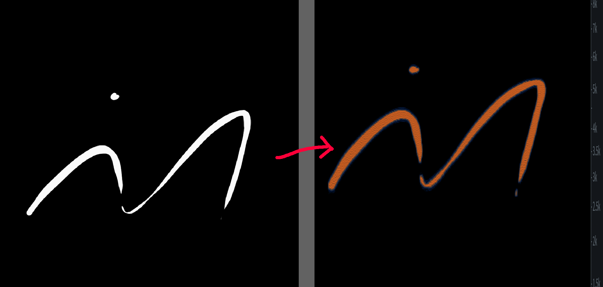

# Spectrum To Audio



A little python program that takes in a png input file and outputs a wav file that produces a similar spectrogram. 

Built so that I could follow on with [this](https://www.youtube.com/watch?v=EmPZidUuvGI) spectral watermarking video by Ravarcheon without harmor.

Recommended to use png images under 1024x1024, the processing time take a little while if you use longer. 

## Usage:

```
python3 s2a.py input_filename min_frequency max_frequency sample_rate output_filename
```

e.g.
```
python3 s2a.py logoblack.png 1000 8000 44100 output.wav
```

